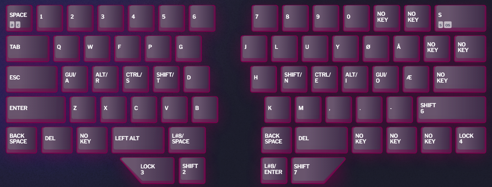
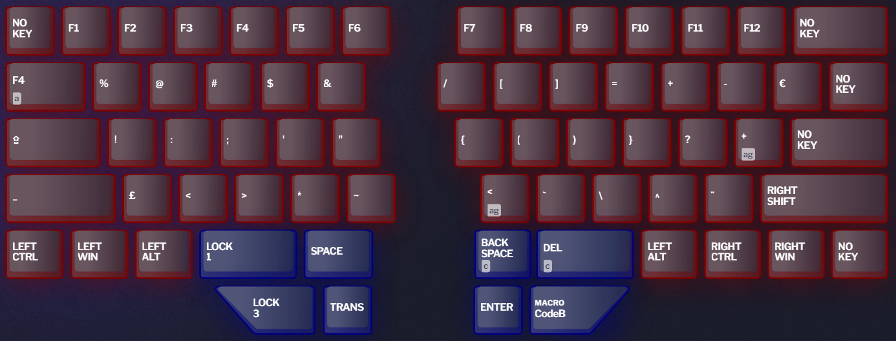
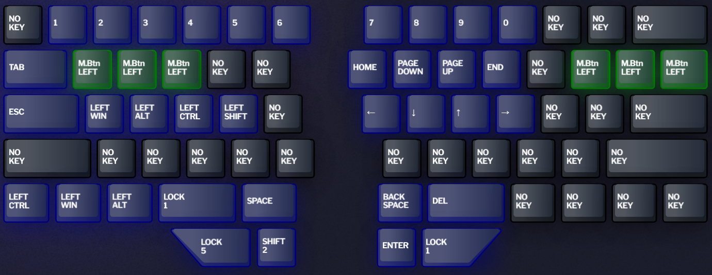
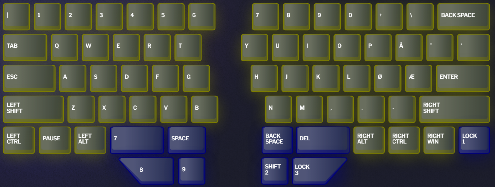
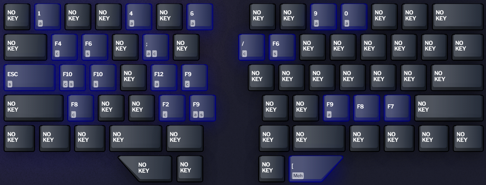
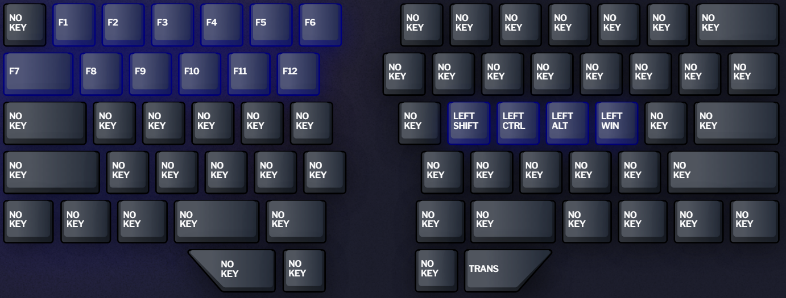
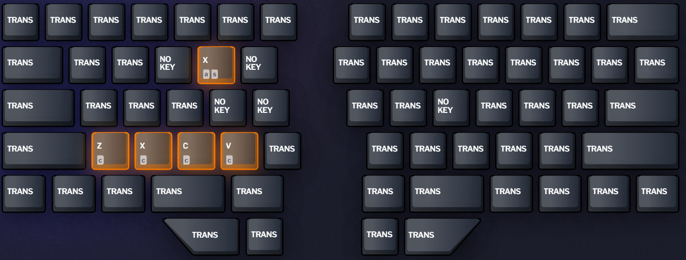

# My Dygma Raise layers

This repo explains my approach to using layers in my Dygma Raise keyboard.  
Importing layers.json to your keyboard might require some tweaking, but it should work on Bazecor version 1.0.0 and firmware version 1.0.9beta

---

## Layers

### Layer 1

- Base layer
  - Colemak layout with added scandinavian letters
  - Utilizes home row modifiers (GACS order)
    - For more information on home row mods refer to [this page](https://precondition.github.io/home-row-mods)
- Left side
  - Capslock is replaced with escape for easier access
  - Regular modifiers (shift, ctrl, gui, alt) are replaced with enter, backspace, delete and no key
    - These are purely for easier one-handed use when right hand is on mouse
    - Left alt is still available for easy alt+tab use, but it is moved one step to the right
  - Escape is replaced with my shortcut to accept code completion in my IDEs
- Right side
  - Backspace, delete and enter are moved to the thumb cluster
  - All regular modifiers are removed along with enter and upper right symbol keys
  - Backspace replaced with windows snipping tool shortcut

---

### Layer 2

- Symbols layer with F-keys
  - Contains all symbols available in the finnish keymap
    - The point is to never have to use top row numbers for symbols
  - Lock 1 on both sides serve no actual purpose
- Left side
  - Tab replaced with Alt+F4
  - Capslock is there if it is ever needed
- Right side
  - Backspace and delete have ctrl added as a modifier for easier whole word deletion
  - Macro CodeB for quick markdown code blocks.
  - Some symbols are not shown correctly in the image
  
    | Shown                  | Actual symbol |
    |------------------------|---------------|
    | < ag (above backspace) | \|            |
    | \ (above DEL)          | `             |
    | + ag (next to ?)       | \             |

---

### Layer 3

- Movement layer
  - Lots of Mouse Button Left for max Cookie Clicker spam ;)
  - Lock 5 changes layer to an experimental mouse layer

---

### Layer 4

- Gaming layer
  - Qwerty layout for easy game compatibility
  - Extra number keys in left side thumb cluster for more bindings

---

### Layer 5

- Mouse layer

---

### Layer 6

- JetBrains IDE shortcuts

---

### Layer 7

- For mod + F-key combos

---

### Layer 8

- Left-handed undo, cut, copy and paste shortcuts are a bit awkward to use, so they have their own layer
- Alt+shift+x for easy access to password manager
